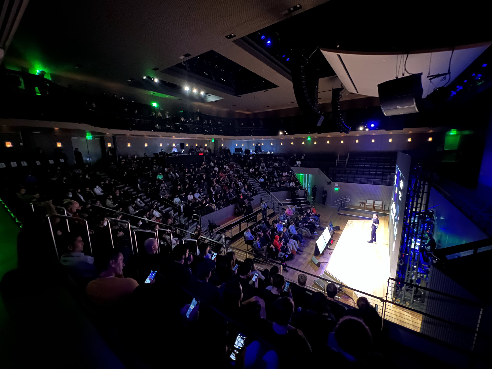

## React Server Components

#### The Costs & The Benefits

Hey there, I'm Jeff and I am thrilled to be with you all today to talk a little about React Server Components.

---

## Who am I Anyway?

    - Made websites @ HashiCorp
    - Next.js eng manager @ Vercel
    - Now working @ Clerk

Before we get into it, some quick background on me, let's rewind 5 years of my career. At this point I was starting as the first engineer and later manager of the team at HashiCorp that builds and maintains all of its public websites, like docs, events, marketing, etc.

This is what originally got me involved with next.js. As HashiCorp scaled from ~200 to ~2500 employees and IPO'd over my 4 years there, we heavily invested in next and its architecture to help us scale up.

And last year I made the jump over to Vercel where I managed the next.js team and its roadmap through the delivery of next 13.

Now as of this month I'm working at Clerk! Big thanks to Ben for making the intro for me while I worked on this talk, very excited to get started.

---

And just some extra context in case you didn't believe me - I have been really in deep on nextjs and react for years.

---

# Zooming out on React Architectures

#### Because I'm not that smart and need lots of context 😅

Let' start zoomed out - there has been a lot of discourse on twitter, YouTube, etc that focus on specific technical aspects of RSC.

I am really only an average developer and primarily an eng manager, so I have a hard time keeping up with super deep dives and prefer to start broad and narrow in.

So in the following slides, we'll step through the different react architectures a high level. Because today, **react can be, and often is used in multiple different** ways that each have unique tradeoffs. Then we'll fit RSC into that same thought framework to help to understand where it fits.

---

# Pure Client React (SPA)

    - client-side only
    - use browser apis with impunity
    - don't deal with servers

Let's start with the most basic possible way to use react - just loading it on to a website with a script tag. With all the talk about frameworks we may have forgotten that this is a real thing, but it absolutely is.

This is what create-react-app will spit out for you by default, and this type of architecture is often referred to as a SPA, or "single page app", because the standard way to set things up is to run everything off a single html file that renders a blank page, loads a bundle of javascript, and the javascript deals with rendering the page, doing the routing etc.

A normal setup for this type of app is to run a server or proxy in front of your html page that will return the same single html page for every request.

---

Something like this - every route, regardless of the url, returns the same page.

Then on the client side, javascript looks at the URL and decides how to render the page once it has loaded.

---

# The Downsides:

    - SEO is bad
    - initial load is slow

The problem with this is that search engines and social share crawlers mostly don't render javascript, so they just see a blank html document, which is bad news.

## Also, the initial page load is slow since the browser needs to receive the full response, parse the javascript, execute it, and flush the changes to the DOM changes before the user sees anything.

# Server Rendered React (SSR)

    - runs on client & server
    - initial load becomes fast, SEO is great

Ok, on to the next react architecture, server rendered react, which you might see abbreviated as "SSR", which stands for "server side rendering". In this mode, you render the initial state of each page into a string of html on the server, and send that html as the response, so the user immediately sees the page's contents.

However, the page doesn't do anything because it's all static html. React then loads on the client side with a full copy of the source code and goes through a process called "hydration", where it goes through the rendered html and figures out where it needs to add event handlers and interactivity.

This is very cool because it eliminates both of the downsides of pure client side react: you get a fast initial load since the html is all there, and SEO works fine because the html is all there. But it doesn't come without its own downsides either.

---

# The Downsides:

    - the same code needs to run in browser & node.js
    - you need to figure out hydration
    - you need to run & manage an actual server

The essence of the downsides here are that it's more complicated than pure client react, but that's a very real downside.

When react initially rolled out this functionality, only big companies who could afford to put big resources into it used server rendering, like Facebook and Airbnb. But over time, frameworks like Next, Gatsby, and Remix came out that lowered the barrier to entry for smaller companies and individual developers.

Ok, before we go to the next slide I just want to issue a warning that this may induce some mild anxiety for some of us react developers 😝

---

Anyone familiar with this type of error? This is one of the things you need to deal with when you are server rendering.

Figuring out why this happened and how to fix it requires a solid understanding of how server rendering and hydration actually work, which is relatively complicated. This is not a thing with pure client react.

---

So, between these two cases, we effectively have a tradeoff: in exchange for more complexity and more surface area for issues and errors, we get better performance. So, we can visualize this as something of a graph with the axes being performance benefits and code complexity.

You have no doubt heard many folks declare one or the other to be objectively superior in all circumstances, but nothing could be further from the truth. Whether the tradeoffs of moving from pure client to server rendered react are worth it depends entirely on the situation.

For example, if you are running a small startup that you need to get off the ground quickly, and your app is a dashboard that lives entirely behind a login, it may not be worth investing in server rendering - SEO isn't important to you, and a slightly slower initial load is not likely to cause customer churn, and as a benefit everything gets less complicated, which allows you to move faster.

---

In this case, the graph shifts a bit - suddenly you are getting a lot less benefit for the same increase in complexity, so you may decide that it's not worth it.

---

On the other hand, if you expect to make some dashboards public, or make user profiles shareable, you start to move closer to it being worth it. And if you are building something like a marketing page, where SEO and initial load are critical to its success, going pure client side react probably would not be a good idea - the performance benefit becomes much higher relative to the complexity.

---

It's also worth noting that the complexity of an architecture is not hard set. As I mentioned earlier, tools and frameworks can deliver the same benefits at reduced complexity. And frameworks like next, Gatsby, and others have shifted the complexity of server rendered architecture down substantially and made it more widely accessible.

I hope that this framework helps when making decisions about architecture. But now that we have spent quite a while setting up the context, let's talk about where react server components sits on this spectrum.

---

**It's important not think about react as a single tech choice or single architecture, because it isn't.** Server rendered react is an entirely different thing from SPA react. And Server Component react is an entirely different thing from the two that we have discussed.

It's more complex, but also can offer more performance benefits given the right use case.

With that all said, let's profile the upsides and downsides of RSC in the same way we have for the other react architectures.

---

# React Server Components

    - faster rendering with streaming
    - parallel, non-blocking data loading by default
    - more control and granularity for caching
    - hydrate only what is needed

The upsides effectively amount to what we have said earlier: better performance for complex apps. And this is extra impactful because the larger and more complex the apps, the more important performance becomes, because scale. We'll break down each of these in more detail right after this. First, on to the downsides.

---

# The Downsides:

    - server-only rendering is an entirely new render environment
    - you must be in control of what hydrates and doesn't
    - server/infra does more work, possible downside
    - it's still pretty beta-ish

Again it's been mentioned earlier that the tl;dr of these points is "it's more complicated", but let's get more specific. With client only react there was only one rendering environment: the client. SSR added a second one: client & server. And with RSC we have a third: server only.

There are a lot of implications to this: how does code behave in server-only environments? How is data passed between nested components that are server-only and not server-only? We'll dig into these shortly.

Also worth mentioning, if you are managing your own servers, RSC does more work on the server, so the amount of maintenance and/or infra bills could end up being higher, especially if you have a team that doesn't want to lean further into server setup.

And then of course there's the fact that this is all still quite new, and on top of that it has taken a REALLY LONG time to figure out, with a lot of missteps along the path. Let's dig into that for a minute.

---

## The Rocky Path to RSC

RSC as an architecture was first announced more than 2 years ago by Facebook/meta, and was sometimes called vaporware as a result.

The pattern was first adopted and released for general use by Shopify's framework Hydrogen. Hydrogen ended up dropping RSC though, and their team was pretty open about why they did this and the challenges and obstacles they encountered.

---

I'm just quoting one tweet here but I'll link to the whole thread too in the notes:

-> https://twitter.com/jplhomer/status/1587095536833859584

The short summary here is that implementing the RSC architecture was quite difficult and there were several things that needed to be implemented in just the right way alongside the RSC structure, such as nested routing, error handling, seo metadata, and data loading. Additionally it needed to be a very tight collaboration with the react team, since the process of implementing the architecture turned up plenty of edge cases that needed to be adjusted in react itself.

Its second publicly usable major release was through next.js version 13.

---

This was a big release, at the time I was managing the next.js team and this was definitely a proud moment for me and the team. I took this photo at the conference when it was being announced.

However, the release was still definitely very beta, and the concept of RSC was far from being accepted by the community. It's a little further along now but still has a ways to go - the only major framework implementation of RSC is still beta, and there have been lots of discussions and back-and-forth on twitter etc. about the complexities of the architecture.

With that said, let's get into some of the architecture differences, starting in broad strokes.

---

### ➕ New Rendering Environment (server only)

### ➕ Different rendering environments can be mixed

We mentioned a couple slides ago that RSC introduced a new rendering environment, server-only. That alone is a large mental shift in understanding, loosely equivalent to the shift between client-only react and server-rendered react, which was a very big shift that everyone still has not entirely accepted.

But RSC adds more on top of that - it adds a dynamic in which server only and client/server rendered content can be nested and interleaved together. Let's get into some examples to clarify.

---

Here you can see a client component nested inside a server component. The server component is only rendered on the server and doesn't ship any javascript to the client. The client component is rendered on the server and hydrates on the client.

---

So the natural next step here is, what happens if you flip this around and put a server component into a client component? In theory it should render the client component and inject a server component that isn't hydrated.

But what actually happens is that the import is converted into what's being called a "shared component", and it does hydrate. This also means you may end up accidentally shipping server-only code or secrets the the client by accident.

You can get a server component to render inside a client component with a separate pattern that's a bit more involved, passing it in as a child. I can show this a little later in the upcoming live demo if you all are interested.

So like, there is a bit more complexity to deal with here the way client and server code interacts with each other.

---

But this is just the beginning. There are lots of other edge cases and behaviors to consider with this type of nesting, including what re-renders when, and how data flows through these boundaries.

I thought that this series of tweets from Dan was a really interesting illustration of some of these edges, so we're gonna look through them. Think about these, and notice the split in the answers too.

The premise here is that we have a client component wrapping a server component, and initially the server component is hidden by client state. So, what happens when the user interacts, changing the state to make the server component appear? Does it get fetched from the server or was it already there and just shows?

---

And here's a followup, now the idea is that you have toggled the client component to show the server component, like the last slide, but you have now mutated the data in the server component and told react to refresh the route to reflect this. The question here is, does the state on the wrapping client component get reset as part of this refresh and the server component becomes hidden again?

---

And a second followup - now we have a client component wrapping server components again, and a change is made to the client component which could possibly affect the contained server components, so are they refetched from the server and re-rendered?

If you're an average developer like me, thinking through these scenarios kind of bends your brain. This is a real cost that needs to be really considered when you're thinking about building with RSC.

So, why go for it at all then?

---

# React Server Components

    - faster rendering with streaming
    - parallel, non-blocking data loading by default
    - 	hydrate only what is needed
    - more control and granularity for caching **(demo incoming)**

Remember this slide? This is why. And the tl;dr here is, if you have a very large, very complex app operating at high scale, these benefits are super strong and lead to better performance that we could possibly achieve with non-rsc react.

We saw some examples of streaming rendering and non-blocking data loading in Shaundai's talk before this, so I won't rehash those things. But what I would like to do is show some examples of how the data fetching and caching looks, since this is an important part of the architecture, and is indeed part of react, not just a next.js thing.

---

Background: media/true

Sooooo let's do some live coding! Because I do this in every conference talk I have done and it has definitely never gone wrong 😂

---

## RSC is good for apps with complex data loading needs at scale

So, at this point I am probably running out of time, so let's wrap up.

If you're working with pages that don't need to load data, or load data all at once from a single source, you probably won't be getting most of RSC's upsides.

That doesn't mean not to use it, but it does mean you're paying a little bit higher of a complexity cost and not reaping as much benefit as you could.

I think over-engineered dev blogs are a great example of this - they are not over-engineered because they need to be, they over-engineered for devs to learn new technology.

But if the stakes are high, if you're being paid to build for someone else, carefully make the right architecture decision, don't just spring for the newest or most interesting thing for your own learning.

Also if you are on a team already using RSC for a more complex app, and you then need to create some simpler pages, you do get some benefits by retaining the same stack and reducing the amount of hydration that happens to boost perf on the smaller pages.

That being said, RSC is primarily good for apps that either are currently quite complex and high scale, or ones that are aiming to become that way. For example, a VC funded startup app may not be that complex now, but since it's venture funded, typically massive growth is the goal, so this needs to be heavily considered when thinking about the future architecture.

And of course, frameworks will always be trying to drop the complexity curve down as well, we're just at the beginning phases.

---

## 💖

Thank you so much for bearing with me through this and I really hope it was interesting! Looking forward to hanging out with you all and chatting more about this stuff.

---
